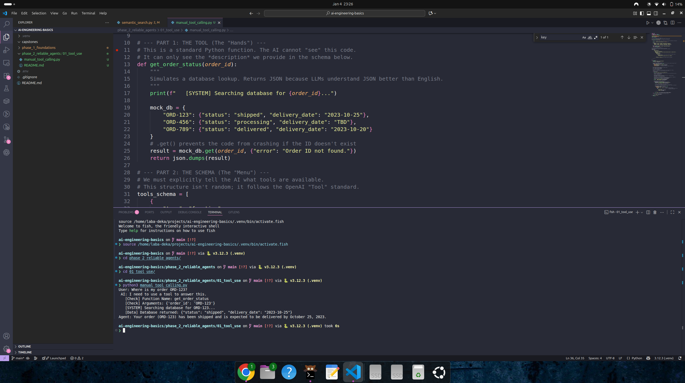

# Phase 2, Day 6: Manual Tool Use

**Goal:** Understand the fundamental mechanics of how Large Language Models (LLMs) interact with external code (Tools).

## The Engineering Concept
LLMs are isolated text-generation engines. They cannot directly access databases or APIs. To bridge this gap, we use **Tool Calling** (or Function Calling).

This involves a 3-step handshake:
1.  **Definition:** The developer provides a JSON schema describing available functions (Tools).
2.  **Selection:** The LLM analyzes the user prompt and, if necessary, outputs a structured request to call a specific function with specific arguments.
3.  **Execution:** The runtime (this script) intercepts the request, executes the actual Python code, and feeds the result back to the LLM for the final response.

## Code Overview
In `manual_tool_calling.py`, we implement this loop from scratch without using high-level frameworks (like LangChain or FastMCP).
* **The Tool:** `get_order_status` simulates a database lookup.
* **The Schema:** `tools_schema` defines the interface for the LLM.
* **The Loop:** We manually parse the `tool_calls` from the OpenAI response and execute the corresponding function.

This pattern is the foundational building block for all Agentic workflows.

## Usage

### 1. Run the Agent
Execute the script to see the tool calling process in the terminal logs.
```
    python manual_tool_calling.py
```
### 2. Expected Output
You will see the "Brain" request the tool, the "Hands" execute it, and the "Brain" formulate the final answer.
```
    User Query: Where is my order ORD-123?
    Model requested a tool call.
       Function: get_order_status
       Arguments: {'order_id': 'ORD-123'}
       Output: {"status": "shipped", "delivery_date": "2023-10-25"}
    Agent Response: Your order ORD-123 has been shipped and is expected to be delivered on October 25, 2023.

```

