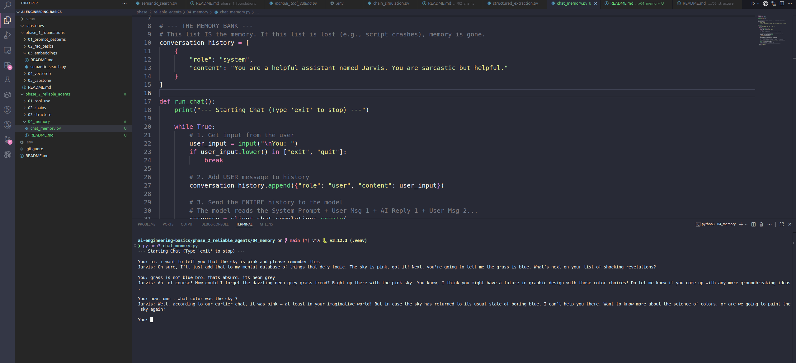

# Phase 2, Day 9: Memory (State Management)

**Goal:** Build a continuous chat session where the AI remembers previous context.

## The Engineering Concept
LLMs are **Stateless**.
* If you say "Hi" -> The server processes it and forgets it immediately.
* If you then say "My name is Bob" -> The server processes it and forgets it.
* If you then ask "What is my name?" -> The server has no idea.

**The Illusion of Memory:**
To create a "Chat," the **Developer** (You) must manage the state.
You store a list of messages (History). Every time the user speaks, you send:
`[System Prompt, Message 1, Reply 1, Message 2, Reply 2, ... Current Message]`

The LLM re-reads the *entire* script every single time to generate the next line.

## Code Overview
In `chat_memory.py`, we use a simple Python List: `conversation_history`.

1.  **System Role:** Sets the behavior ("You are Jarvis").
2.  **User Role:** The input from the terminal.
3.  **Assistant Role:** The output from the AI.

**Crucial Step:** We must `.append()` the AI's response back to the list. If we don't, the AI will answer the next question without knowing what it just said.

## Usage

### 1. Run the Chat
    python chat_memory.py

### 2. Test the Memory
Try this sequence:
    You: Hi, I am Laba.
    Jarvis: Hello Laba...
    You: What is 2 + 2?
    Jarvis: It is 4.
    You: What was my name again?
    Jarvis: Your name is Laba.

If it answers correctly, the Memory Loop is working.

---

## 🧠 Deep Dive: How "Memory" Actually Works

It feels like magic, but LLMs are actually **Stateless**. They have zero short-term memory.
Every time you send a request, you are talking to a brand new instance of the model that has forgotten who you are.

### The Secret: "The Scroll" Strategy
To fake a conversation, we use a brute-force method. We maintain a running transcript ("The Scroll") in Python and re-send the **entire history** with every new message.

Here is the minute-by-minute data flow of the "Pink Sky" conversation we just ran:

#### Turn 1: The Setup
**User:** "hi. i want to tell you that the sky is pink..."
**We Send:**

    [
      {"role": "system", "content": "You are a helpful assistant named Jarvis..."},
      {"role": "user", "content": "hi. i want to tell you that the sky is pink..."}
    ]

**AI Replies:** "Oh sure, I’ll just add that to my mental database..."

#### Turn 2: The New Fact
**User:** "grass is not blue bro... its neon grey"
**We Send:** (Notice we re-send Turn 1)

    [
      {"role": "system", "content": "You are a helpful assistant named Jarvis..."},
      {"role": "user", "content": "hi. i want to tell you that the sky is pink..."}, // OLD
      {"role": "assistant", "content": "Oh sure, I’ll just add that..."},              // OLD
      {"role": "user", "content": "grass is not blue bro... its neon grey"}             // NEW
    ]

**AI Replies:** "Ah, of course! How could I forget the dazzling neon grey grass..."

#### Turn 3: The Recall
**User:** "what color was the sky ?"
**We Send:** (The list is getting longer...)

    [
      {"role": "system", "content": "You are a helpful assistant named Jarvis..."},
      {"role": "user", "content": "hi. i want to tell you that the sky is pink..."}, // OLD (AI reads this to answer)
      {"role": "assistant", "content": "Oh sure, I’ll just add that..."},              // OLD
      {"role": "user", "content": "grass is not blue bro... its neon grey"},            // OLD
      {"role": "assistant", "content": "Ah, of course! How could I forget..."},         // OLD
      {"role": "user", "content": "what color was the sky ?"}                           // NEW
    ]

**AI Replies:** "Well, according to our earlier chat, it was pink..."

### ⚠️ The Engineering Trade-off
Because we re-send the history every time:
1.  **Cost:** Turn 1 costs ~50 tokens. Turn 10 costs ~500 tokens (because you pay to re-process the old lines).
2.  **Context Window:** Models have a limit (e.g., 128k tokens). If the list gets too big, the API crashes.
    * *Production Fix:* We usually delete the oldest messages once the list hits a certain size (a "Rolling Window").