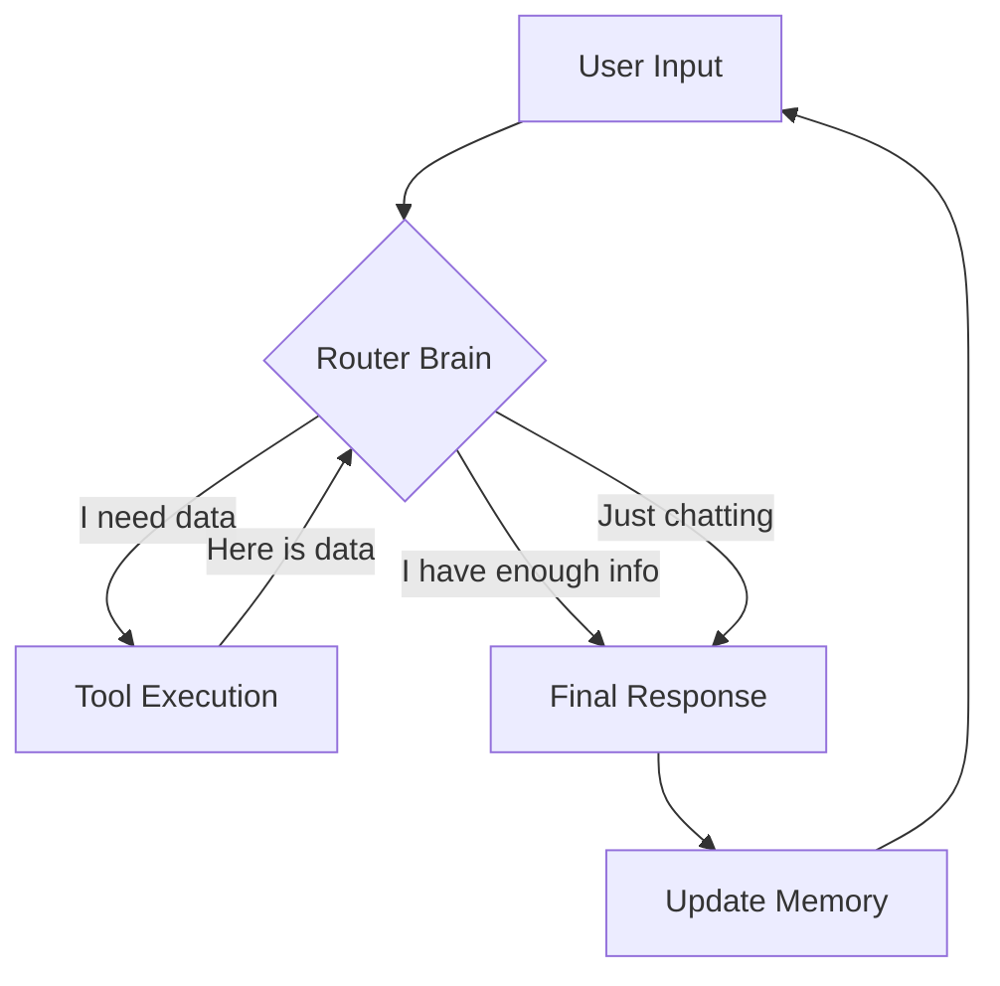

# Phase 2: Reliable Agents (The Hands)

**Goal:** Build a system that can **DO** things, not just **KNOW** things.

---

## 🗺️ The Map: From "Brain" to "Body"

In **Phase 1**, we built a "Brain in a Jar."
Our system could read documents and answer questions perfectly. But it was **paralyzed**. It could not check a live calendar, it could not query a database, and it certainly couldn't send an email. It was trapped in the past (training data) and isolated from the real world.

In **Phase 2**, we will give the AI a **Body**.
We are moving from *Passive Retrieval* (reading) to *Active Execution* (doing).

### The Analogy: Training a New Hire
Imagine we have just hired a brilliant, Harvard-educated intern (the LLM). They have read every book in the world, but they are currently locked in an empty room with no computer and no phone. They are smart, but useless.

Here is how we will train them over the next 5 modules:

1.  **Giving them "Hands" (Tools):**
    First, we need to unlock the door. We will give the intern a "phone" (a Python function). Now, if we ask "What is the weather?", they can't answer it themselves, but they can pick up the phone, call the Weather Station, and tell us the answer.

2.  **Teaching them "Process" (Chains):**
    The intern now has a phone, but they are scatterbrained. If we say "Order me a pizza," they panic. We need to teach them a sequence: *First* ask for the topping, *Then* ask for the address, *Then* call the pizza place. We will build loops to handle these multi-step dependencies.

3.  **Enforcing "Rules" (Structure):**
    Sometimes the intern gets creative and writes reports in poetry or scribbles on napkins. This breaks our filing system. We will force them to fill out strict, standardized forms (JSON/Pydantic) so their output never crashes our downstream systems.

4.  **Giving them a "Notebook" (Memory):**
    Currently, the intern has amnesia. Every time we leave the room, they forget who we are. We will give them a notebook (State) where they must write down every conversation. Before they answer us, they must read the notebook to recall what we said five minutes ago.

5.  **Promoting them to "Manager" (Routing):**
    Finally, the intern becomes autonomous. They sit at the front desk. When a user walks in, *they* decide: "Does this person need me to look up a database record (Work)? or do they just want to chat (Talk)?" This is the ultimate goal: a self-directing agent.

---

## 📂 Module Breakdown

### [01_tool_use](./01_tool_use) - The Handshake
**The Concept:** The "Handshake" Illusion.
**What we will do:** We will teach the AI to acknowledge its own limitations. When it doesn't know an answer (e.g., "Where is order #123?"), it will not hallucinate. Instead, it will generate a structured request asking **us** (the Python script) to run a specific function.
**Key Lesson:** The AI does not run code. It asks *us* to run code.

### [02_chains](./02_chains) - The Sequence
**The Concept:** Dependency Logic.
**What we will do:** We will tackle problems that cannot be solved in one shot. We will build a `while` loop that allows the AI to "wake up" after using a tool, inspect the result, and realize it needs to use *another* tool before it can answer us.
**Key Lesson:** Agency is just a loop that runs until the job is done.

### [03_structure](./03_structure) - The Guardrails
**The Concept:** Type Safety.
**What we will do:** We will stop parsing messy text with regex. We will use **Pydantic** to treat the LLM prompt like a database schema. We will force the AI to return valid Python objects, guaranteeing that our code never crashes due to a typo or a missing comma.
**Key Lesson:** Never trust a string. Always validate.

### [04_memory](./04_memory) - The Context
**The Concept:** State Management.
**What we will do:** We will simulate a continuous conversation. Since the AI is stateless (it forgets us instantly), we will build a system that maintains a "Scroll" of history and re-sends the entire conversation context with every new message.
**Key Lesson:** "Memory" is just an ever-growing list of strings sent over the network.

### [05_routing](./05_routing) - The Brain (Capstone)
**The Concept:** Autonomous Decision Making.
**What we will do:** We will combine everything. We will build a **Router Agent** that acts as a traffic controller. It will analyze the user's intent and dynamically decide whether to route the request to a Database Tool or a General Chat handler.
**Key Lesson:** This is the standard architecture for production agents.

---

## 🧠 Deep Dive: The "Agent Loop" Architecture

By the end of Phase 2, we will have built this exact architecture. This is the blueprint for almost every modern AI Agent:

In Phase 1, we learned how to make the AI **Read**.
In Phase 2, we will learn how to make the AI **Act**.

