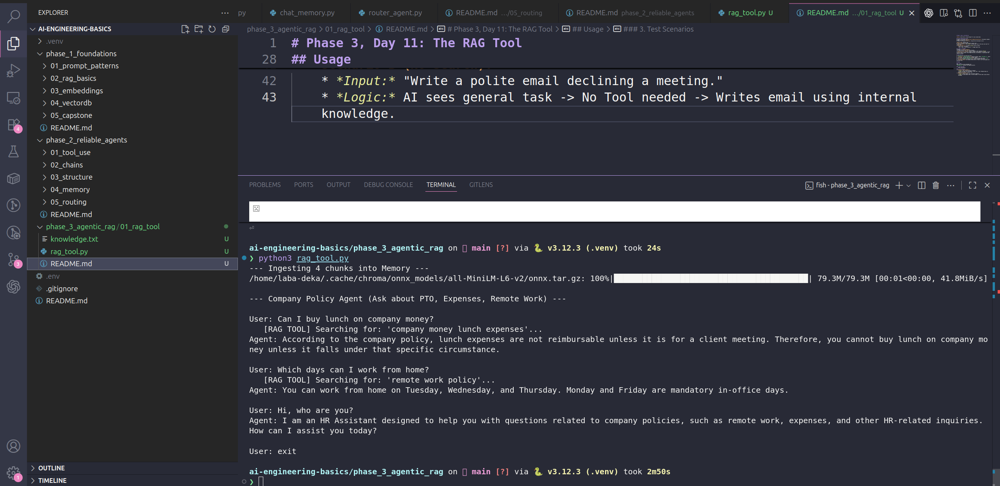

# Phase 3, Day 11: The RAG Tool

**Goal:** Give the AI a "Search Engine" for your private data.

## 🧠 The Engineering Concept
In Phase 1, we learned **RAG (Retrieval Augmented Generation)**. We manually loaded a document and gave it to the AI.
In Phase 2, we learned **Tool Use**. We gave the AI functions to call.

**Agentic RAG** combines them.
We wrap our RAG logic (Vector Search) inside a Tool.
* **Old Way (Phase 1):** We *always* retrieve data, even if the user just said "Hi." (Inefficient).
* **New Way (Phase 3):** The Agent *decides* when to search.
    * User: "Hi" -> No Search.
    * User: "What is the PTO policy?" -> Trigger Search Tool.

## 📦 What is ChromaDB?
ChromaDB is a **Vector Database**.
* It does not store text like a Word document.
* It stores text as **Vectors** (lists of numbers) that represent *meaning*.
* **Why we use it:** It allows "Semantic Search." If you search for "Latte", it finds the policy about "Coffee", even though the words are different. It understands that Lattes are Coffee.

## Code Overview
**`rag_tool.py`** has three main parts:
1.  **Ingestion (`ingest_documents`):** Runs at startup. Reads `knowledge.txt`, splits it into chunks, and saves them into ChromaDB's memory.
2.  **The Tool (`search_knowledge_base`):** A simple function that takes a `query` string, asks ChromaDB for the most relevant chunk, and returns that text.
3.  **The Agent Loop:** The standard loop we built in Phase 2, but now equipped with the Search Tool.

## Usage

### 1. Setup
Make sure you have the knowledge file:
`knowledge.txt` (Contains the company policies).

### 2. Run the Agent
    python rag_tool.py

### 3. Test Scenarios
* **Scenario A (Search Needed):**
    * *Input:* "Can I work from home on Fridays?"
    * *Logic:* AI sees "work from home" -> Calls Tool -> Gets "Monday/Friday are mandatory in-office" -> Answers "No."
* **Scenario B (No Search):**
    * *Input:* "Write a polite email declining a meeting."
    * *Logic:* AI sees general task -> No Tool needed -> Writes email using internal knowledge.

    

    ---

## 🧠 Deep Dive: The Vector Database (ChromaDB)

We act like ChromaDB is a magic box, but it is a specific piece of engineering.

### 1. What does it store?
It does not store text like a normal database. It stores **Vectors** (Lists of Numbers).
When you run `.add(documents=["Hello world"])`:
1.  Chroma uses an embedding model (e.g., all-MiniLM-L6-v2) to convert "Hello world" into a vector: `[0.034, -0.21, 0.99, ...]`.
2.  It stores this array of floats, linked to the original text.

### 2. Where does it live?
In our script, we used `chromadb.Client()`.
* **Location:** Your computer's RAM.
* **Lifespan:** Ephemeral. It dies when the script ends.

**For Production:**
We would use `chromadb.PersistentClient(path="./db")` to save to disk, or run ChromaDB as a separate Docker container so multiple agents can query it simultaneously.

### 3. Why ChromaDB?
* **Vs. Pinecone:** Pinecone is cloud-only (Paid/Managed). Chroma is open-source and runs locally (Free/Private).
* **Vs. Postgres (pgvector):** Postgres is great if you already have it. Chroma is purpose-built for AI and easier to set up for Python prototypes.

---

## 🔍 Code Flow: The Step-by-Step Breakdown

It can be confusing to see where "Chroma" ends and "OpenAI" begins. Here is the forensic timeline of a single user query.

### Phase A: The Silent Setup (Local)
**Code:** `ingest_documents()` -> `collection.add(...)`
* **What happens:** When you start the script, Python reads `knowledge.txt`.
* **The "Magic" Line:** Inside `collection.add`, ChromaDB automatically downloads a small AI model to your laptop. It reads your text and converts it into hidden lists of numbers (Embeddings).
* **Location:** Your Laptop's RAM. (No internet used).

### Phase B: The Trigger (Remote)
**Code:** `client.chat.completions.create(..., tools=tools)`
* **User:** "Can I buy lunch?"
* **What happens:** Python sends this text to OpenAI.
* **The Decision:** OpenAI reads the prompt. It sees you have a tool description for "Company Policies." It decides *not* to answer, but to ask *you* to run a search.
* **Return:** It returns a JSON object: `call_function: "search_knowledge_base", args: "lunch expenses"`.

### Phase C: The Retrieval (Local)
**Code:** `search_knowledge_base()` -> `collection.query(...)`
* **What happens:** Your Python script wakes up. It sees the request from OpenAI.
* **The "Magic" Line:** Inside `collection.query`, ChromaDB takes the keyword "lunch expenses", converts it to numbers locally, and finds the closest matching paragraph in RAM.
* **Result:** It pulls out the text: *"Lunch is NOT reimbursable..."*

### Phase D: The Synthesis (Remote)
**Code:** `messages.append(...)` -> `client.chat.completions.create(...)`
* **What happens:** Python pastes that retrieved text into the chat history.
* **Final Call:** It sends the whole conversation back to OpenAI:
    * *User:* "Can I buy lunch?"
    * *System (Hidden):* "Tool Result: Lunch is NOT reimbursable..."
* **The Answer:** OpenAI reads the fact and generates the final English reply: *"No, you cannot expense lunch unless it is a client meeting."*