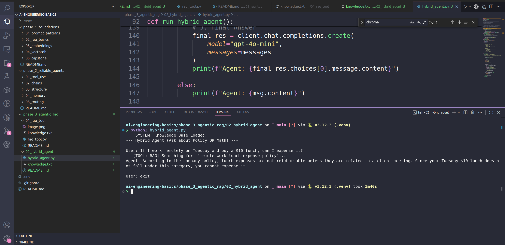

# Phase 3, Day 12: The Hybrid Agent

**Goal:** Build an agent that can dynamically choose between different types of tools (Math vs. Reading).

## The Engineering Concept: The Router
In real production systems, agents have access to dozens of tools. The challenge isn't "running" the tool, it's **Routing**.
The AI must accurately parse the user's intent and select the correct tool (or tools) from a list.

### The "Keyhole Problem" (Retrieval Context)
A common mistake in RAG is setting `n_results=1` (Top-1 Retrieval).
* **The Problem:** If a user asks a complex question like *"Can I expense lunch on a remote day?"*, the answer might be split across two different documents (Policy A: Remote Work, Policy B: Expenses).
* **The Failure:** If we only retrieve 1 document, the AI only sees half the truth and hallucinates the rest.
* **The Fix:** We set `n_results=3` in `collection.query()`. This forces the tool to return a broader window of context.

## Usage

### 1. Run the Agent
    python hybrid_agent.py

### 2. The Experiments

* **Test 1 (RAG):** "What days can I work remote?"
    * *Result:* The Router triggers `search_knowledge_base`.
    
* **Test 2 (Math):** "What is 250 times 12?"
    * *Result:* The Router triggers `calculate_tool`.
    
* **Test 3 (Complex):** "If I work remotely on Tuesday and buy a $10 lunch, can I expense it?"
    * *Result:* The AI searches the database. Because we fetch 3 documents, it reads **both** the Remote Policy (Tuesday is allowed) AND the Expense Policy (Lunch is NOT allowed).
    * *Answer:* "No. While Tuesday is a valid remote day, lunch is not reimbursable."

---

## 🧠 Deep Dive: The "Searchlight" Strategy

Why don't we just feed the **whole** knowledge base to the AI every time? Why do we select only 3 chunks?

### The "Exam Cheat Sheet" Analogy
Imagine the AI is taking a history exam.
* **The Textbook:** Your Database (10,000 pages).
* **The Cheat Sheet:** The AI's Context Window (Limited space).

The AI cannot bring the whole textbook into the exam. It must choose what to write on its cheat sheet *before* answering the question.

1.  **Scanner Method (Bad):** Reading every page one by one. This is too slow (hours) and too expensive ($$$).
2.  **Searchlight Method (Good):** We use Vector Search to shine a light on the **top 3 pages** that seem relevant. We copy only those 3 pages onto the cheat sheet.

**The Trade-off:**
* If we select too few (`n=1`), we might miss the answer (The Keyhole Problem).
* If we select too many (`n=20`), we fill the cheat sheet with garbage (Noise), confusing the AI.
* **`n=3`** is the industry standard "Goldilocks" zone for simple queries.

