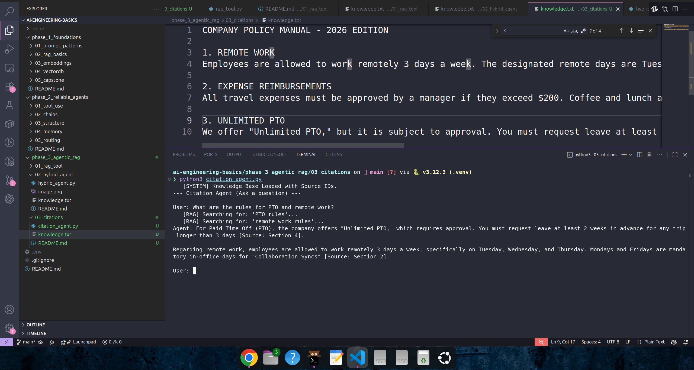

# Phase 3, Day 13: Citations & Evidence

**Goal:** Force the AI to prove its answers by citing sources.

## The Engineering Concept: "Grounding"
In AI, **Grounding** means tying the model's output to a verifiable fact.
Hallucinations happen when the model relies on its *training data* (vague memory) instead of the *context data* (retrieved facts).

By forcing **Citations**, we achieve two things:
1.  **Trust:** The user can verify the answer.
2.  **Accuracy:** The AI is less likely to lie if it knows it must point to a specific document.

### How we implemented it
We changed the data flow of the RAG tool:

**Before (Day 11-12):**
> "Lunch is not reimbursable."

**After (Day 13):**
> "[Source: Policy #2 - Expenses] Lunch is not reimbursable."

Because we feed this structured string to the LLM, the LLM "sees" the source name right next to the fact. Our System Prompt then instructs it to repeat that name in the final answer.

## Usage

### 1. Run the Agent
    python citation_agent.py

### 2. Test Scenarios
* **Input:** "When can I work from home?"
* **Expected Output:** "You can work from home on Tue, Wed, and Thu [Source: Policy #1 - Remote Work]."

* **Input:** "Can I buy coffee?"
* **Expected Output:** "No, coffee is not reimbursable [Source: Policy #2 - Expenses]."

---

## 🔍 Deep Dive: The "Injection" Technique (How Citations Work)

It feels like magic when the AI says *"Source: Policy #1"*. You might wonder: Does the AI look at the file path? Does it read the metadata?

No. The AI is a text processor. It only knows what is written in the string we send it. To make citations work, we perform a trick called **Context Injection**.

We literally **glue** the source name onto the text before the AI ever sees it.

### Step 1: The Raw Search (ChromaDB)
When we query the database, we ask for two things: the **Documents** (Text) and the **IDs** (Source Names).

ChromaDB returns them as separate lists:

    docs = ["Employees can work remote...", "Lunch is not free..."]
    ids  = ["Policy #1 - Remote Work", "Policy #2 - Expenses"]

### Step 2: The "Glue" (Python)
This is the critical engineering step. We don't just send the text. We write a Python loop to `zip` these lists together and format them into a specific structure.

**The Code Logic:**

    context_pieces = []
    for doc, source_id in zip(docs, ids):
        # We inject the ID right above the text
        formatted_string = f"[Source: {source_id}]\n{doc}"
        context_pieces.append(formatted_string)
    
    final_payload = "\n\n".join(context_pieces)

### Step 3: The Payload (What OpenAI Sees)
When we send the `tool` output back to OpenAI, this is the **exact string** the model reads. Notice how the source is now part of the content:

    [Source: Policy #1 - Remote Work]
    Employees are allowed to work remotely 3 days a week...

    [Source: Policy #2 - Expenses]
    Coffee and lunch are NOT reimbursable...

### Step 4: The Instruction (The Brain)
Finally, our System Prompt gives the order:

    "ALWAYS cite your source using square brackets. If the source is not explicitly provided, do not make one up."

### Step 5: The Synthesis
The AI follows a simple logic chain:
1.  **Fact Retrieval:** It finds the sentence about "lunch."
2.  **Label Check:** It looks immediately above that sentence and sees `[Source: Policy #2 - Expenses]`.
3.  **Generation:** It writes the answer and copies that label to the end, exactly as instructed.

**Key Takeaway:**
Citations are not "Intelligence." They are **Data Formatting**. The Engineer (You) injects the label into the input string, and the AI copies it to the output string.

### Analogy: The Museum Placard

To visualize this process, imagine an Art Museum.

* **The Document:** The Painting (The visual information).
* **The Metadata:** The small brass plaque next to the painting (Title, Artist, Date).
* **The AI:** A Tour Guide.

If the museum hangs a painting without the brass plaque, the Tour Guide can describe the art ("It is a woman smiling"), but they cannot tell you who painted it or when it was made. They would have to guess.

**What we did in Day 13:**
We acted as the Curator. We physically screwed the brass plaque ("[Source: Policy #1]") onto the frame of the painting before letting the Tour Guide see it.

Now, when the Tour Guide looks at the art to answer a visitor's question, they simply read the text on the plaque out loud along with their description. They aren't "remembering" the source; they are just reading what we put in front of them.

