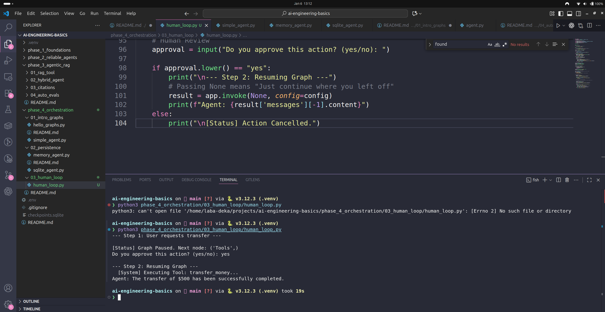

# Phase 4, Day 18: Human-in-the-Loop (The Pause Button)

**Goal:** Build a "Semi-Autonomous" agent that pauses execution to ask for human permission before performing sensitive actions (like transferring money or reading private data).

---

## 📖 The "Why" (The Safety Problem)

An autonomous agent is dangerous by default.
* **Scenario:** You tell an agent, "Clean up my files."
* **Result:** It runs `rm -rf /` and deletes your operating system.

In production (especially HealthTech or FinTech), we cannot allow this. We need a **"Pause Button"** that freezes the graph right before a tool is executed, allows a human to inspect the action, and then decides whether to "Resume" or "Cancel."

---

## 📂 The Code

### `human_loop.py`
This script simulates a Banking Bot with two tools:
1.  `check_balance` (Safe) -> Runs automatically.
2.  `transfer_money` (Unsafe) -> Triggers a system pause.

---

## 🧠 Deep Dive: The Mechanics

This module uses advanced LangGraph features. Here is exactly what happens under the hood.

### 1. The Decorator (`@tool`)
**Concept:** The "Menu Item."
* **Code:** `@tool`
* **Function:** It inspects your Python function and auto-generates a **JSON Schema**.
* **Why:** The LLM cannot read Python. It needs a JSON definition to know that `transfer_money` requires an integer `amount`.

### 2. The Checkpointer (`MemorySaver`)
**Concept:** The "Save Game" File.
* **Code:** `checkpointer=memory`
* **Function:** You cannot pause a program in RAM unless you save its state. The checkpointer writes the current variables (`messages`, `next_node`) to memory/disk so the process can die and resume later.

### 3. The Interrupt (`interrupt_before`)
**Concept:** The "Freeze Ray."
* **Code:** `compile(interrupt_before=["Tools"])`
* **Function:** This tells the Graph Orchestrator:
    > "Run normally. But if you are ever about to enter the 'Tools' node, **STOP**. Save the state, and exit the process."

### 4. The Inspection (`get_state`)
**Concept:** The "X-Ray."
* **Code:** `app.get_state(config)`
* **Function:** While the graph is frozen, we peek inside. We can see exactly what the LLM *wants* to do (e.g., "Call `transfer_money(500)`") before it actually happens.

### 5. The Resume (`invoke(None)`)
**Concept:** The "Unpause Button."
* **Code:** `app.invoke(None, config=config)`
* **Function:** Passing `None` as input tells LangGraph: "Do not start a new conversation. Just find the paused thread (`config`) and continue running from where you left off."

---

## 🏃‍♂️ Usage Guide

### 1. Run the Script
    python3 human_loop.py

### 2. The Interaction
* **User:** "Transfer $500."
* **Agent:** Decides to call the tool.
* **System:** `[Status] Graph Paused. Next node: ('Tools',)`
* **Prompt:** `Do you approve this action? (yes/no):`

### 3. The Outcome
* **If "yes":** The system executes the tool (`Transfer successful`) and the LLM reports back.
* **If "no":** You can modify the script to inject a "Cancelled" message (logic not shown in basic demo, but possible).

---

## 🔮 What's Next?
We have now mastered:
1.  **Logic** (Graphs)
2.  **Memory** (Persistence)
3.  **Safety** (Human-in-the-Loop)

We are ready for the **Phase 4 Capstone: The Shift Orchestrator**.
We will combine Pydantic (Structured Data), Deterministic Tools (Routing), and Human-in-the-Loop (Compliance) to build a production-grade system

