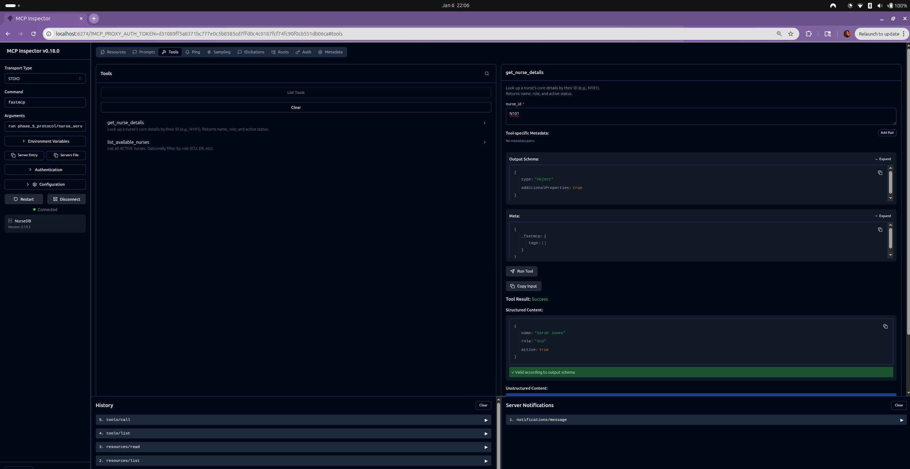

# Phase 5: The Protocol (Part 01)

**Goal:** Build a standalone **FastMCP Server** that exposes data (Tools & Resources) without containing any LLM logic itself.

---

## 1. The Concept: Client-Host-Server

We are decoupling the "Brain" from the "Information."

* **The Host (The Client):** This is the AI Agent (e.g., Claude Desktop, or our future Pydantic AI script). It contains the LLM.
* **The Protocol (MCP):** The "USB Cable" that connects the two. It uses **JSON-RPC** messages.
* **The Server:** This is the program we are building below. It wraps a database or file system and waits for commands.

---

## 2. The Code: Nurse Database Server

This server exposes:
1.  **Tools:** Functions to query nurse status (`get_nurse_details`).
2.  **Resources:** Read-only logs (`shift://logs`).

**File:** `phase_5_protocol/nurse_server.py`

    from typing import List, Dict
    from fastmcp import FastMCP
    
    # 1. Initialize
    mcp = FastMCP("NurseDB")

    # --- MOCK DATA ---
    NURSE_DB = {
        "N101": {"name": "Sarah Jones", "role": "ICU", "active": True},
        "N102": {"name": "Mike Chen", "role": "ER", "active": False},
    }

    SHIFT_LOGS = """
    [2026-01-01] N101: Checked in 08:00 AM.
    [2026-01-01] N102: Called in sick.
    """

    # --- 2. TOOLS (Functions) ---
    @mcp.tool()
    def get_nurse_details(nurse_id: str) -> Dict:
        """Look up a nurse by ID."""
        return NURSE_DB.get(nurse_id, {"error": "Not found"})

    @mcp.tool()
    def list_nurses(role: str = None) -> List[str]:
        """List active nurses, optionally filtered by role."""
        return [
            f"{n['name']} ({id})" 
            for id, n in NURSE_DB.items() 
            if n['active'] and (not role or n['role'] == role)
        ]

    # --- 3. RESOURCES (Files) ---
    @mcp.resource("shift://logs")
    def get_logs() -> str:
        """Read the shift logs."""
        return SHIFT_LOGS

    if __name__ == "__main__":
        mcp.run()

---

## 3. How to Run & Verify

Since this script has no web server, we use the **FastMCP Inspector** to test it.

1.  **Install FastMCP:**
    
        pip install fastmcp

2.  **Run the Inspector:**
    
        fastmcp dev phase_5_protocol/nurse_server.py

3.  **Verify in Browser:**
    * Open `http://localhost:5173`.
    * Click on **Tools** -> `get_nurse_details`.
    * Enter Argument: `N101`.
    * Click **Run**.
    * **Success:** You should see `{"name": "Sarah Jones"}` in the Output panel.

---

## 4. Deep Dive: How does this work?

You might wonder: *How is a Web Browser talking to a Python script that has no Flask/FastAPI code in it?*

### The "Dev Mode" Proxy Architecture
When you run `fastmcp dev`, you start a **Middleware Proxy**.

    [ Browser ]  <-- HTTP -->  [ FastMCP Proxy ]  <-- Stdio -->  [ Python Script ]

1.  **The Browser** sends an HTTP POST request to the Proxy: `{"method": "call_tool", "params": "N101"}`.
2.  **The Proxy** receives this. It knows your Python script is running as a **subprocess**.
3.  **The Proxy** "types" the JSON-RPC message directly into your script's **Standard Input (stdin)**.
4.  **Your Script** (via the `fastmcp` library) reads the input, runs the function, and "prints" the result to **Standard Output (stdout)**.
5.  **The Proxy** captures that print statement, converts it back to HTTP, and sends it to the Browser.

**Why do this?**
It mimics how real AI Agents (like Claude Desktop) work. They don't use HTTP requests; they "spawn" your tool as a sub-process and talk to it via text streams. This is faster and more secure than opening network ports.

---

## 5. Vocabulary: Stdio vs. SSE

There are two ways to connect an Agent to an MCP Server.

### 1. Stdio (Standard Input/Output)
* **What is it?** Direct communication via the console streams (`stdin`/`stdout`).
* **Use Case:** **Local Agents.** When you run Claude Desktop app, it runs your server locally on your machine.
* **Pros:** Extremely fast, zero network configuration, highly secure (no open ports).
* **Cons:** Cannot work if the Agent is on a different computer.

### 2. SSE (Server-Sent Events)
* **What is it?** A standard web protocol where a server pushes data to a client over a long-lived HTTP connection.
* **In MCP Context:** This is used for **Remote Agents**. If your Agent is in the Cloud (e.g., a web app) and your Database is in a private VPC, you use SSE.
    * **Client** sends `POST` request (e.g., "Call Tool").
    * **Server** pushes the result back via the open `SSE` channel.
* **Why not WebSockets?** SSE is simpler (unidirectional text stream) and works better with standard corporate firewalls.

