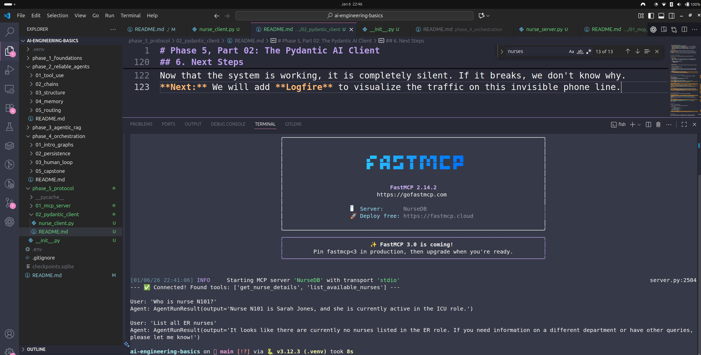

# Phase 5, Part 02: The Pydantic AI Client

**Goal:** Build a "Brain" (Client) that connects to our independent "Data Warehouse" (Server) using the MCP protocol.

---

## 1. The Concept: Professional Kitchen Architecture

To understand why we built this, consider the evolution of our architecture:

* **Phase 1-4 (The Home Cook):**
    Everything was in one room. The LLM, the Tools, and the Data were all inside `main.py`.
    * **Pro:** Simple to start.
    * **Con:** Hard to scale. If you wanted to change the database, you had to rewrite the bot.

* **Phase 5 (The Restaurant Chain):**
    We have separated the roles into a Distributed System.
    * **The Client (`nurse_client.py`):** This is the **Head Chef**. It has the intelligence (LLM) but no ingredients. It sits in the Kitchen.
    * **The Server (`nurse_server.py`):** This is the **Warehouse**. It has the ingredients (Data) but no intelligence. It sits in a separate building.
    * **The Protocol (MCP):** This is the **Phone Line**. The Chef calls the Warehouse to request items.

**Why do this?**
1.  **Security:** The AI never touches the raw database. It only asks the Server to run specific, safe functions.
2.  **Scalability:** You can move the Server to a massive cloud cluster without changing the Client code.
3.  **Resilience:** If the Server crashes, the Client can just redial (restart the subprocess).

---

## 2. The Code: `nurse_client.py`

This script acts as the bridge between the Pydantic AI library and the MCP Protocol.

**Key Components:**

1.  **The Launcher:**
    It does not import the server code. Instead, it "spawns" it as a separate process using `StdioServerParameters`. This creates a secure pipe (`stdin`/`stdout`) between the two files.

    server_params = StdioServerParameters(
        command="python",
        args=[SERVER_SCRIPT], 
        ...
    )

2.  **The Handshake:**
    Before the AI speaks, the Client connects to the Server and asks: *"What tools do you have?"*
    
    await session.initialize()
    tools_list = await session.list_tools()

3.  **The Binding (The Glue):**
    The LLM needs to know how to use these tools. We create local Python functions (decorated with `@agent.tool`) that act as proxies. When the AI calls them, they forward the request over the MCP pipe.

    @agent.tool
    async def list_nurses(ctx, role: str = None) -> str:
        # Forwards the request to the Server via JSON-RPC
        result = await session.call_tool("list_available_nurses", ...)

---

## 3. The Execution Flow (The 8-Second Lifecycle)

When you run `python nurse_client.py`, the following choreography happens in milliseconds:

**Act 1: The Spawn**
* The Client script starts.
* It silently launches `python nurse_server.py` in the background.
* A direct data pipe is established between them.

**Act 2: The Handshake**
* **Client:** Sends a `JSON-RPC Initialize` message.
* **Server:** Wakes up, replies "Ready", and lists its tools (`get_nurse_details`, `list_available_nurses`).
* **Client:** Registers these names internally so it knows they exist.

**Act 3: The Query**
* **User:** "List all ER nurses."
* **LLM (Brain):** Decides it needs to call a tool. It selects `list_nurses` with argument `role='ER'`.
* **Client (Proxy):** Converts this intent into a JSON packet: `{"method": "list_available_nurses", "args": {"role": "ER"}}`.
* **Server (Worker):** Receives the packet. Runs its logic. Finds zero matches. Returns `[]` (Empty List).

**Act 4: The Response**
* **Client (Proxy):** Receives the empty list. Our defensive code catches it and returns the string: *"No nurses found matching that criteria."*
* **LLM (Brain):** Reads that string and generates the final polite answer: *"It looks like there are currently no nurses listed in the ER role."*

---

## 4. Troubleshooting & Gotchas

We encountered two specific "Senior Engineering" bugs during development:

**Bug 1: Naming Mismatch**
* **Issue:** The Server defined `list_available_nurses`, but the Client tried to call `list_nurses`.
* **Result:** The MCP library rejected the call because the tool name didn't match the handshake list.
* **Fix:** Ensure the string passed to `session.call_tool("EXACT_NAME")` matches the Server exactly.

**Bug 2: Empty Results**
* **Issue:** When no nurses matched, the Server returned an empty list. The Client tried to access `result.content[0]`, which caused an `IndexError`.
* **Fix:** Defensive coding. We added a check `if not result.content:` to handle empty responses gracefully.

---

## 5. How to Run

Ensure you are in the project root:

    python phase_5_protocol/02_pydantic_client/nurse_client.py

**Expected Output:**

    --- 🔌 Connecting to MCP Server... ---
    --- ✅ Connected! Found tools: ... ---

    User: 'Who is nurse N101?'
    Agent: Nurse N101 is Sarah Jones...

    User: 'List all ER nurses'
    Agent: It looks like there are currently no nurses listed in the ER role...

---

## 6. Next Steps

Now that the system is working, it is completely silent. If it breaks, we don't know why.
**Next:** We will add **Logfire** to visualize the traffic on this invisible phone line.

